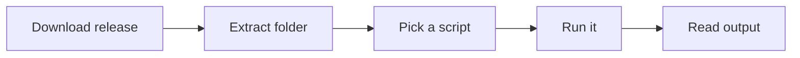

# universal-script-hub

*A no-install script pack for people who are tired of hunting down a different tiny tool every time Windows misbehaves.*

## What this is

Most people don't need a suite of software — they need one script, once, for one annoying problem: a stuck update, a network reset, a cleanup pass before selling a laptop. Then they're back searching a month later for a different problem with a different half-abandoned forum thread. universal-script-hub is a maintained collection of standalone Windows scripts built around that exact moment — the one where you just want the fix, not a new app to manage.

I started this as a personal folder of `.ps1` and `.bat` files I kept rewriting from scratch. Turning it into a public, versioned hub was the obvious next step: same scripts, same "no install, no nonsense" philosophy, but organized, tested across Windows 10 and 11, and documented so anyone can tell what a script does before they run it. Every script here is meant to be read, not blindly trusted — that's part of what "universal" means in this project.

  

The button above opens the project's landing page, where the current release is available for download.

## Who it is for

- **Home users** who want one reliable fix for a specific Windows annoyance without installing another background app.
- **IT support techs** who reimage or troubleshoot machines and want a portable script kit on a USB stick.
- **Sysadmins** managing a handful of machines who need repeatable, readable maintenance scripts, not a black-box agent.
- **Refurbishers and resellers** prepping used PCs who need consistent cleanup and reset scripts across many devices.
- **Power users** who just prefer scripts they can open in Notepad and understand over apps they have to trust blindly.

## What you can do

- **Run any script standalone** — no installer, no background service, no account required.
- **Read every line before executing** — plain PowerShell and batch, nothing obfuscated or compiled.
- **Cover common Windows pain points** — network resets, update repairs, temp-file cleanup, driver refresh helpers.
- **Pick exactly what you need** — grab one script, not a bundled suite you didn't ask for.
- **Reuse across machines** — copy the folder to a USB drive and run the same scripts on any Windows PC.
- **Update independently of Windows** — new scripts and fixes ship on their own schedule, not tied to OS updates.
- **Check version history per script** — each one is dated so you know it's not a stale 2019 copy-paste.
- **Skip the toolchain entirely** — no compilers, no SDKs, no dependencies to install first.

## Getting started

1. Open the landing page using the download button on this README.
2. Download the current release package for Windows.
3. Extract it to any folder — a Desktop folder or USB drive both work fine.
4. Open the script you need and read the short header comment describing what it does.
5. Run it (most are PowerShell — right-click → Run with PowerShell, or Run as Administrator if the header says so).

## Requirements

| OS | RAM | Disk |
|---|---|---|
| Windows 10 (64-bit, build 1809+) | 2 GB minimum | 50 MB free |
| Windows 11 (any build) | 4 GB recommended | 100 MB free |

No .NET SDK, no Python, no Node, no package manager. If PowerShell or `cmd.exe` already runs on your machine, these scripts will too.

## How it works

1. You download the release archive from the landing page — no repository cloning needed.
2. You extract the folder locally; scripts stay fully offline and self-contained.
3. You open the script that matches your problem and skim the header comment.
4. You run it directly through PowerShell or Command Prompt, with elevated rights only when the script asks for them.
5. The script reports what it changed in plain text output, so nothing happens silently.

## FAQ

**What makes these "universal" scripts instead of just Windows utilities?**
They're written to work across Windows 10 and 11, across different hardware, without depending on a specific build number, locale, or pre-installed software beyond what Windows ships with by default.

**Do I need to run these as Administrator?**
Some do, most don't. Each script's header comment states this explicitly — if it needs elevation, it tells you before you run it, not after it fails.

**Can I use one script without downloading the whole collection?**
Yes. The release package is organized by category, so you can extract just the folder you need and ignore the rest.

**Will this conflict with my antivirus?**
Some antivirus products flag PowerShell scripts by default, since they can modify system settings. That's expected behavior for legitimate admin scripts, not a sign the script is malicious — read the source before allowing an exception.

**How often are scripts updated or added?**
There's no fixed schedule; scripts are added and revised when a real problem shows up worth solving properly, which is also why version dates matter more here than a changelog number.

## Troubleshooting

- **PowerShell blocks the script with an "execution policy" error.** This is Windows' default safety setting, not a bug. Check the script's header for the recommended policy scope, then adjust it for that session only rather than disabling it system-wide.
- **The script asks for Administrator rights and I don't have them.** Some fixes genuinely require elevation (network stack resets, system file repairs). If you're on a managed or work machine, ask an admin rather than trying to force it.
- **Antivirus quarantines the archive on download.** Re-check the file against the landing page's published checksum, then restore it from quarantine once confirmed — this is a common false positive for script bundles.
- **A script finishes but nothing seems to change.** Read the printed output — most scripts report success/no-op explicitly; a "no change needed" result usually means the problem it targets wasn't present on your system.

## License

Released under the [MIT License](LICENSE). Scripts are provided as-is — read them before running, especially anything that touches system settings, and use your own judgment on machines you don't own.

  

